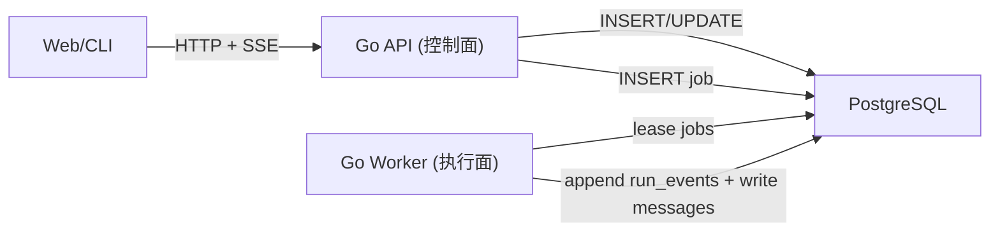

# Go 重构路线（Backend / API 迁移，薄片设计）

本文给出 Arkloop 从 “Python API + Go Worker” 逐步迁移到 “Go API + Go Worker” 的可行性评估与完整迁移计划。

原则与 `golang-worker-first-refactor-plan.zh-CN.md` 保持一致：
- 采用薄片（Vertical Slice）推进
- 每个薄片都要求：可上线、可回滚、可测
- 冻结对外契约（HTTP/SSE/DB/job payload），优先替换实现，而不是改协议

本文仅讨论 **Backend / 控制面（API + 数据访问 + 鉴权 + SSE 回放 + 审计）** 的 Go 化；Agent 执行面由 Go Worker 负责（已完成 Go 重写）。

> 状态：本仓库已完成 P.10 收口（Go API 位于 `src/services/api/`；Python API 与 `in_process` 已删除）。本文保留为迁移过程记录，部分章节会引用迁移前的 Python 文件路径与规模统计。

## 0. 可行性结论

结论：**可行，并且适合薄片迁移，不需要 Big Bang**。

基于仓库现状的判断依据：
- 运行面已经稳定外置：API 只负责 enqueue + SSE 回放；执行链路在 Go Worker 内闭环。
- 核心不变量语言无关：
  - `jobs.payload_json` 是跨语言协议（API 写，Worker 读）。
  - `run_events` 是唯一真相（Worker 写，API 读；前端/CLI 回放）。
- Python 控制面规模不大（按“生产路径，不含 in_process 兜底”口径）：
  - API 层（排除 in_process 专用模块）约 2060 行
  - data/auth/job_queue/config/observability 等支撑包约 2755 行
  - 合计约 4815 行（不含 migrations）

主要难点（需要提前承认）：
- SSE 的兼容性与细节（断线重连、心跳、flush、batch 语义）容易被“看起来能跑”的实现坑到。
- Auth/JWT 的语义必须 100% 对齐（尤其是 `iat` 精度与 `tokens_invalid_before` 的失效逻辑）。
- 测试体系当前以 pytest 为主，且大量 integration 用例强制 `in_process`；若你决定丢弃 in_process，需要同步迁移测试策略，否则会出现“代码迁完了但无法回归”的断档。

## 1. 当前基线（与可迁移边界）

### 1.1 迁移前控制面职责（Python API）

迁移前 Python API（已下线并删除）实际承担：
- 认证：`/v1/auth/*` + `/v1/me`
- 资源：threads/messages/runs（创建、列表、patch、取消）
- SSE：`/v1/runs/{run_id}/events` 从 DB 回放 `run_events`
- 审计：登录/登出、拒绝访问、取消 run 等写 `audit_logs`

与执行面有关但应逐步退出的部分（in_process 兜底）：
- `services/api/provider_routed_runner.py`
- `services/api/run_engine.py`
- `packages/agent_core` / `packages/llm_gateway` / `packages/mcp` / `packages/skill_runtime` / `packages/llm_routing`

如果你明确“不再支持 in_process”，这部分可以进入冻结期，最终删除。

### 1.2 已有稳定边界（迁移时必须利用）

1) HTTP API 契约（对前端/CLI 稳定）
- 端点与 JSON 字段：`src/services/api/v1.py`
- Web 端类型与调用：`src/apps/web/src/api.ts`

2) 错误与 trace 约定（全局可观测性）
- `X-Trace-Id` header（服务端生成，透传到响应）：`packages/observability/http.py`
- ErrorEnvelope：`services/api/error_envelope.py`

3) SSE 回放约定（事件即真相）
- SSE 轮询参数：`after_seq` / `follow`，心跳与 batch：`services/api/sse.py`
- 事件 envelope：`event_id/run_id/seq/ts/type/data`：`services/api/v1.py`

4) 数据库 schema（短期保持不变）
- migrations：`src/migrations/versions/*`

5) Job payload 协议（API 写、Worker 读）
- Python enqueue：`packages/job_queue/pg_queue.py`
- Go Worker queue protocol（已对齐）：`services/worker/internal/queue/*`

### 1.3 迁移阻力最大区域（Backend 视角）

不是“代码多”，而是“出错代价高”：
- Auth/JWT：签发与校验、logout 失效语义、refresh 行为必须完全一致。
- SSE：对 flush/断线重连/游标的兼容；一旦不一致，前端会出现“偶发卡死/丢事件”这种最难排查的问题。
- DB 事务边界：`create_run_with_started_event` 这类“写 run + 写第一条事件 + enqueue job”必须是可解释的原子行为。
- 审计：拒绝访问与关键动作必须写入，且不能影响主请求成功率（审计失败要降级，而不是把主请求搞挂）。

## 2. 迁移不变量（必须冻结）

这些契约在 Go API 迁移过程中必须保持不变，否则前端、CLI、审计与回放会连锁破坏。

### 2.1 HTTP 与错误模型

- `X-Trace-Id` 行为：
  - 服务端默认生成 trace_id
  - 每个 HTTP 响应都带 `X-Trace-Id`
- ErrorEnvelope JSON：
  - `code`（稳定机器码）
  - `message`（给人看的短文）
  - `trace_id`
  - `details`（可选）

### 2.2 SSE 协议

- URL：`GET /v1/runs/{run_id}/events`
- Query：
  - `after_seq`（>=0）
  - `follow`（默认 true）
- 数据：
  - SSE event id 使用 `seq`（字符串）
  - `data` 是 JSON，包含 `event_id/run_id/seq/ts/type/data`
- 语义：
  - `seq` 在同一 run 内严格递增
  - follow=true 时必须有心跳（comment ping），避免代理断链

### 2.3 Auth/JWT 语义

- HS256
- `typ=access`
- `sub=user_id`
- `iat` 需要保留子秒（Python 侧用 float 秒）
- logout 通过更新 `users.tokens_invalid_before` 实现：`iat < tokens_invalid_before` 判定 token 失效

### 2.4 DB 语义（短期冻结）

- 表结构与约束在迁移期保持一致（先换服务端实现，不先改 schema）
- 允许在迁移期新增索引/视图，但不得破坏现有读写逻辑

### 2.5 jobs.payload_json 协议

至少包含：
- `v`
- `job_id`
- `type`（仍为 `run.execute`）
- `trace_id`
- `org_id`
- `run_id`
- `payload`

## 3. 目标架构（Go API + Go Worker）

### 3.1 拓扑



关键约束：
- API 不执行 Agent Loop、不触发任何 tool executor
- Worker 是执行面唯一事实来源
- API 的“可扩容性”来自它只做控制面（DB CRUD + SSE 回放）

### 3.2 目录设计与命名策略

当前（P.10 之后）目录已收口为：
- Go API：`src/services/api/`
- Go Worker：`src/services/worker/`
- Python API：已下线并从仓库移除

历史迁移期（P.01 ~ P.09）曾使用 `api_go` 目录与 Python 并行运行；最终在 P.10 重命名为 `api` 并删除 Python 控制面代码。

建议最小结构：

```text
src/services/api/
  go.mod
  cmd/
    api/
      main.go
  internal/
    app/            # composition root（依赖注入、配置加载、启动）
    http/           # router、middleware、handlers
    auth/           # jwt/bcrypt + 当前用户解析
    data/           # repositories（pgx）
    audit/          # audit_logs 写入
    sse/            # SSE 回放（run_events）
    observability/  # trace_id、json logging
```

命名收口策略：
- P.01 ~ P.08：使用 `api_go`，确保 Python/Go 可并行运行与切流。
- P.10：重命名为 `api`，并删除 Python 控制面（本分支已完成）。

### 3.3 共享契约包（建议尽早做，但保持极简）

为了避免 API enqueue 的 job payload 与 Worker 解包逻辑漂移，建议尽早引入一个 **极小** 的共享 Go 包（只放常量/结构，不放业务）：
- `job payload schema`（字段名、版本、type 常量）
- `run event types`（若你希望前后端事件类型也统一）
- `trace header` 名称常量

形式上可以是：
- `src/services/shared_go/`（单独 go.mod，供 api 与 worker require + replace）
或
- 统一迁移成单一 go.work（把多个模块纳入同一 workspace）

不要在这里放 repository 或业务逻辑，避免“共享包变成第二个单体”。

## 4. 薄片计划（Backend 迁移）

说明：每个薄片都要求“可验收、可回滚、默认不破坏生产路径”。薄片命名采用 `P.01` 形式（与 Worker 文档不同）。

### P.01 契约冻结与回归基线（Backend）

- 目标：把 Go API 迁移过程最容易漂移的契约固化成可执行回归资产。
- 改动：
  - 固化 HTTP 契约样例（建议以“黑盒”方式）：覆盖
    - auth/login/refresh/logout/register/me
    - threads/messages/runs 的最小闭环
    - SSE 的断线重连（after_seq）与心跳
  - 固化关键 JSON 字段与状态码（包括 401/403/404/409/422/500）。
  - 固化 `jobs.payload_json` 的字段集合与版本号（确保 API enqueue 与 Worker 解析一致）。
- 验收：
  - 现有 Python API 路径下，契约测试 100% 通过。
- 回滚：
  - 无需回滚，仅新增测试与文档资产。

### P.02 Go API 工程骨架（不接管流量）

- 目标：建立可运行的 Go API 骨架，只暴露 `/healthz`，不做任何业务。
- 改动：
  - 新建 `src/services/api_go/`，实现：
    - dotenv 加载（复用 Worker 的 env 约定：`ARKLOOP_LOAD_DOTENV`、`ARKLOOP_DOTENV_FILE`）
    - JSON 日志（字段对齐：`trace_id` 必须出现）
    - Trace middleware：生成/注入 `X-Trace-Id`
    - ErrorEnvelope：统一错误返回
  - 仅实现 `GET /healthz`。
- 验收：
  - `go run ./cmd/api` 可启动
  - `curl /healthz` 返回 `{"status":"ok"}`
  - 任意未知路由返回 ErrorEnvelope 且包含 `X-Trace-Id`
- 回滚：
  - 不影响生产；直接停用 Go API。

### P.03 PostgreSQL 接入与“只读 readiness”

- 目标：Go API 能稳定连接 Postgres，并在启动/探针阶段对 schema 做最小校验。
- 改动：
  - 新增 DB 连接池（建议 `pgxpool`）。
  - 实现 `GET /readyz`（可选）：
    - 能连上 DB
    - 能读到 `alembic_version`（迁移期）或关键表存在（最终）
  - 不引入 ORM；用 repository pattern 封装 SQL。
- 验收：
  - 本地 docker compose 起 PG 后，Go API readiness 正常
  - DB 断开时 readiness 失败但进程不 panic（日志可观测）
- 回滚：
  - 不影响生产；直接停用 Go API。

### P.04 Auth v1（对齐 Python 行为）

- 目标：在 Go API 中实现完整 auth 闭环，并与现有前端/CLI 兼容。
- 改动：
  - 实现端点：
    - `POST /v1/auth/login`
    - `POST /v1/auth/refresh`
    - `POST /v1/auth/logout`
    - `POST /v1/auth/register`
    - `GET /v1/me`
  - bcrypt：对齐 cost 与校验行为（不做花活，保持可预测）
  - JWT：严格对齐 Python 的 claim（`sub/typ/iat/exp`）与 `iat` 精度
  - logout：更新 `users.tokens_invalid_before`，并在每次鉴权时校验 `iat`
  - 审计：login/register/logout/refresh 写 `audit_logs`（审计失败必须降级，不影响主流程）
- 验收：
  - 前端能在 Go API 上完成登录/注册/登出/刷新并正常调用受保护资源
  - “登出后旧 token 失效”的语义与 Python 一致（重点测）
- 回滚：
  - Go API 作为并行服务：切回 Python API 即可。

### P.05 Threads v1（写接口迁移开始）

- 目标：迁移 threads 的 CRUD，建立资源级鉴权与游标分页的稳定实现。
- 改动：
  - 实现端点：
    - `POST /v1/threads`
    - `GET /v1/threads`（游标：`before_created_at + before_id` 必须成对出现）
    - `GET /v1/threads/{thread_id}`
    - `PATCH /v1/threads/{thread_id}`
  - 鉴权策略保持 owner-only（与 Python 一致）。
  - 访问拒绝写审计（拒绝原因要可解释：org_mismatch/owner_mismatch/no_owner）。
- 验收：
  - 前端 threads 列表与打开线程行为正常
  - 分页游标语义一致（422 校验错误一致）
- 回滚：
  - 切回 Python API。

### P.06 Messages v1

- 目标：迁移 messages 写入与列表，确保 thread/org 一致性校验与错误码一致。
- 改动：
  - 实现端点：
    - `POST /v1/threads/{thread_id}/messages`
    - `GET /v1/threads/{thread_id}/messages`
  - 内容长度限制对齐（max_length=20000）。
  - 保持 `role="user"` 写入逻辑不变。
- 验收：
  - 前端发消息后能在 messages 列表看到写入内容
  - 越权访问返回 403 且有 `X-Trace-Id`，并写入访问拒绝审计
- 回滚：
  - 切回 Python API。

### P.07 Runs v1（创建 run + enqueue job）

- 目标：迁移 runs 控制面，并打通 “创建 run -> enqueue -> Go Worker 执行 -> SSE 回放” 的完整闭环。
- 改动：
  - 实现端点：
    - `POST /v1/threads/{thread_id}/runs`（写 run.started，并 enqueue job）
    - `GET /v1/threads/{thread_id}/runs`
    - `GET /v1/runs/{run_id}`
    - `POST /v1/runs/{run_id}:cancel`（写 cancel_requested）
  - DB 事务边界明确化：
    - “创建 run + 写 started event + enqueue job” 必须可解释（推荐同一事务内完成；若需要分段，必须写清楚失败恢复策略）
  - Job payload 与 Worker 约定严格对齐（字段、版本、type）。
- 验收：
  - 前端创建 run 后，Go Worker 能消费并写 `run_events`，SSE 可实时回放
  - cancel 行为可回放：run.cancel_requested -> run.cancelled（由 Worker 负责补齐）
- 回滚：
  - 切回 Python API（注意：Go Worker/DB 仍在；回滚仅影响控制面路由）。

### P.08 SSE v1（完全对齐）

- 目标：Go API 的 SSE 行为与 Python 兼容，能承受断线重连与长连接。
- 改动：
  - 实现 `GET /v1/runs/{run_id}/events`：
    - after_seq 游标
    - follow=true 时心跳 comment
    - batch_limit/poll_seconds/heartbeat_seconds 与 env 对齐
    - headers：`Cache-Control: no-cache`、`X-Accel-Buffering: no`
  - flush：每条事件应尽快 flush，避免代理缓冲导致“看起来卡住”
- 验收：
  - Web 端稳定消费 SSE（断线后能用 after_seq 自动续传）
  - CLI（如果仍用 Python client）能稳定重连（不要求迁 CLI，但 SSE 行为必须支撑）
- 回滚：
  - 按路由切回 Python SSE。

### P.09 Go API 灰度切流（读写分离可选）

- 目标：在不做 Big Bang 的前提下，把生产流量逐步切到 Go API。
- 改动（两种策略二选一，按你们运维形态）：
  - 策略 A：反向代理按 path 分流（推荐）
    - 先切只读：`GET /healthz`、`GET /v1/runs/*/events`、`GET /v1/threads`
    - 再切写接口：threads/messages/runs/auth
  - 策略 B：客户端 base_url 切换（适合内测/单租户）
    - Web 用 `VITE_API_BASE_URL`
    - CLI 用 `ARKLOOP_API_BASE_URL`
- 验收：
  - 同一套前端/CLI 不改协议即可切换到 Go API
  - 发生问题时能在分钟级切回 Python API
- 回滚：
  - 回滚只涉及路由/配置，不涉及 DB 回滚。

### P.10 Python API 下线（控制面收口）+ 删除 in_process

- 目标：彻底结束 Python 控制面与 in_process 兜底，避免“开发/生产不一致”长期存在。
- 改动：
  - 删除/下线 Python API 生产入口（按你的回滚要求选择）：
    - 保留代码但不再部署，或直接删除 `src/services/api/`
  - 删除 `ARKLOOP_RUN_EXECUTOR=in_process` 路径及其相关依赖：
    - `services/api/provider_routed_runner.py`
    - `services/api/run_engine.py`
    - Python 侧 `packages/agent_core/llm_gateway/mcp/skill_runtime/llm_routing`（如果已无其它路径依赖）
  - 更新文档与启动方式（`src/docs/README.zh-CN.md`、`docs/使用方式for human.md`）。
- 验收：
  - 生产/预发只剩 Go API + Go Worker 两个后端进程角色
  - `ARKLOOP_RUN_EXECUTOR` 相关环境变量不再存在或不再生效
- 回滚：
  - 若你决定“硬切后不保留 Python 回滚”，则回滚只能依赖发布回滚到旧版本（与 Worker 文档的收口策略一致）。

### P.11 Migrations Go 化（收口）

- 目标：去掉 Alembic 作为生产依赖，让“建库/迁移/回滚”全链路 Go 化。
- 改动：
  - 选择 Go migration 工具（建议 goose；也可 migrate）
  - 把现有 migrations 转写成纯 SQL（或按工具要求组织）
  - Go API 在启动时做 schema version 检查（不再依赖 alembic head）
- 验收：
  - 新环境可用 `goose up` 一键建库到最新
  - CI 能验证 schema version 与代码期望一致
- 回滚：
  - 迁移工具切换本质是“运维收口动作”，应单独发布并提供一次性回滚窗口（例如保留 Alembic 升级脚本一段时间）。

### P.12 Python 清理与仓库收敛（Everyone to Go 收尾）

- 目标：仓库内不再依赖 Python 作为运行时（可保留少量一次性迁移脚本，但不作为主路径）。
- 改动：
  - 移除 Python packages（data/auth/job_queue/config/observability 等）与依赖文件（requirements/pyproject），或迁到 tools/ 作为非生产资产
  - 测试体系迁移到 Go（或 Node），替换 pytest 作为主回归入口
  - CLI 是否迁 Go：视团队优先级；若不迁，也至少把“生产后端”彻底 Go 化
- 验收：
  - `go test ./...` 覆盖核心契约（auth、threads/messages/runs、SSE、jobs payload）
  - 本地与 CI 不再要求 Python 才能跑通主流程
- 回滚：
  - 回滚只能靠发布系统回滚；仓库层面不应长期保留两套运行时。

## 5. 风险清单与降险策略

1) SSE 不兼容导致前端“偶发卡死/丢事件”
- 策略：P.01 固化黑盒 SSE 契约测试；P.08 单独阶段验收；上线前 shadow 对比（同 run_id 同 after_seq 拉两边结果）可选。

2) JWT 细节不一致导致“登出不生效/误判失效”
- 策略：把 `iat` 精度与 `tokens_invalid_before` 的比较写成强约束测试；Go/Python 互签互验的对比用例。

3) enqueue 与 Worker 解包漂移
- 策略：共享契约包（3.3）或至少 P.01 做 payload contract test；必要时用 golden JSON 夹具。

4) 双栈运维复杂度上升
- 策略：P.09 只允许“一个方向”的切流，不允许长期双写；每个阶段定义退出条件（达到就删旧实现）。

## 6. 推荐落地顺序（可直接执行）

第一批（先打地基）：
1. P.01 契约冻结
2. P.02 Go API 骨架
3. P.03 DB readiness

第二批（先迁控制面核心路径）：
4. P.04 Auth
5. P.05 Threads
6. P.06 Messages

第三批（打通端到端闭环）：
7. P.07 Runs + enqueue
8. P.08 SSE
9. P.09 灰度切流

收口（按你对回滚的态度硬切）：
10. P.10 Python API 下线 + 删除 in_process
11. P.11 migrations Go 化
12. P.12 Python 清理与测试迁移

---

这份计划的核心是：**先用 Go API 复刻控制面契约，再按路由逐段切流，最后删除 Python 兜底**。这样每一步都可测、可回滚、可交付，风险最小。
