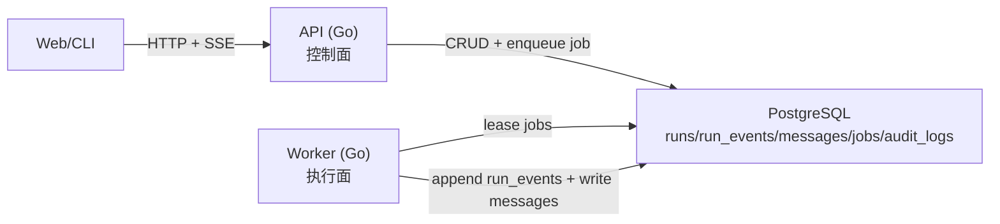

# Run 执行架构（API / Worker）

本文描述 Arkloop 当前的 Run 执行拓扑与服务边界，目标是把“控制面”和“执行面”彻底拆开：
- API 只做鉴权、资源编排、审计落库、SSE 回放、enqueue job
- Worker 负责执行 Agent Loop、工具调用与事件写入
- `run_events` 作为唯一真相，前端/CLI 只通过回放消费事件

> 状态：已下线 Python API 与 `in_process` 执行模式；不再支持 `ARKLOOP_RUN_EXECUTOR`。

---

## 1. 当前拓扑

关键约束：
- API 不执行 Agent Loop、不触发任何 tool executor
- Worker 是执行面唯一事实来源
- API 的可扩容性来自它只做“轻控制面”（DB CRUD + SSE 回放）

---

## 2. 核心不变量（迁移/重构时必须冻结）

- `run_events`：唯一真相
  - Worker 写入
  - API 读取并以 SSE 回放
- `jobs.payload_json`：跨语言协议（API 写，Worker 读）
  - 必须版本化
  - 字段名与语义保持稳定

---

## 3. 最小闭环链路（创建 run -> 执行 -> 回放）

1) Client 创建 run：`POST /v1/threads/{thread_id}/runs`

2) API（同一事务内）完成三件事：
- 写 `runs` 行
- 写第一条事件 `run.started`
- 插入 `jobs`（`run.execute`）

3) Worker 消费 `jobs`：
- lease job
- 执行 RunEngine（Provider 路由 + Agent Loop + Tools + Skills + MCP）
- 追加 `run_events`
- 必要时写 `messages`（assistant 归并结果）

4) Client 通过 SSE 回放：`GET /v1/runs/{run_id}/events`
- `after_seq` 作为唯一游标，断线重连只依赖该游标
- `follow=true` 时 API 必须发送心跳，避免代理断链

---

## 4. 配置（只保留与当前形态一致的 env）

### 4.1 API

- 监听地址：`ARKLOOP_API_GO_ADDR`（或 `PORT`）
- 数据库：`ARKLOOP_DATABASE_URL` / `DATABASE_URL`
- 鉴权：`ARKLOOP_AUTH_JWT_SECRET`、`ARKLOOP_AUTH_ACCESS_TOKEN_TTL_SECONDS`
- SSE：`ARKLOOP_SSE_POLL_SECONDS`、`ARKLOOP_SSE_HEARTBEAT_SECONDS`、`ARKLOOP_SSE_BATCH_LIMIT`
- trace：`ARKLOOP_TRUST_INCOMING_TRACE_ID=1`（仅在反向代理已生成 trace_id 时启用）

### 4.2 Worker

- 数据库：`ARKLOOP_DATABASE_URL` / `DATABASE_URL`
- 消费 loop：`ARKLOOP_WORKER_CONCURRENCY`、`ARKLOOP_WORKER_POLL_SECONDS`、`ARKLOOP_WORKER_LEASE_SECONDS`
- Provider 路由：`ARKLOOP_PROVIDER_ROUTING_JSON`（为空时默认走 stub）
- Tools：`ARKLOOP_TOOL_ALLOWLIST`（为空时禁用全部工具）
- MCP（可选）：`ARKLOOP_MCP_CONFIG_FILE=./mcp.config.json`

---

## 5. 常见问题（排障视角）

- “run 一直 running”：优先检查 `jobs` 是否被 Worker lease、以及 `run_events` 是否有后续事件写入。
- “SSE 偶发卡住”：检查代理是否缓冲（API 应设置 `Cache-Control: no-cache`、`X-Accel-Buffering: no`）以及是否有心跳。
- “事件丢失/乱序”：同一 run 内 `seq` 必须严格递增；回放只用 `after_seq` 续传。
